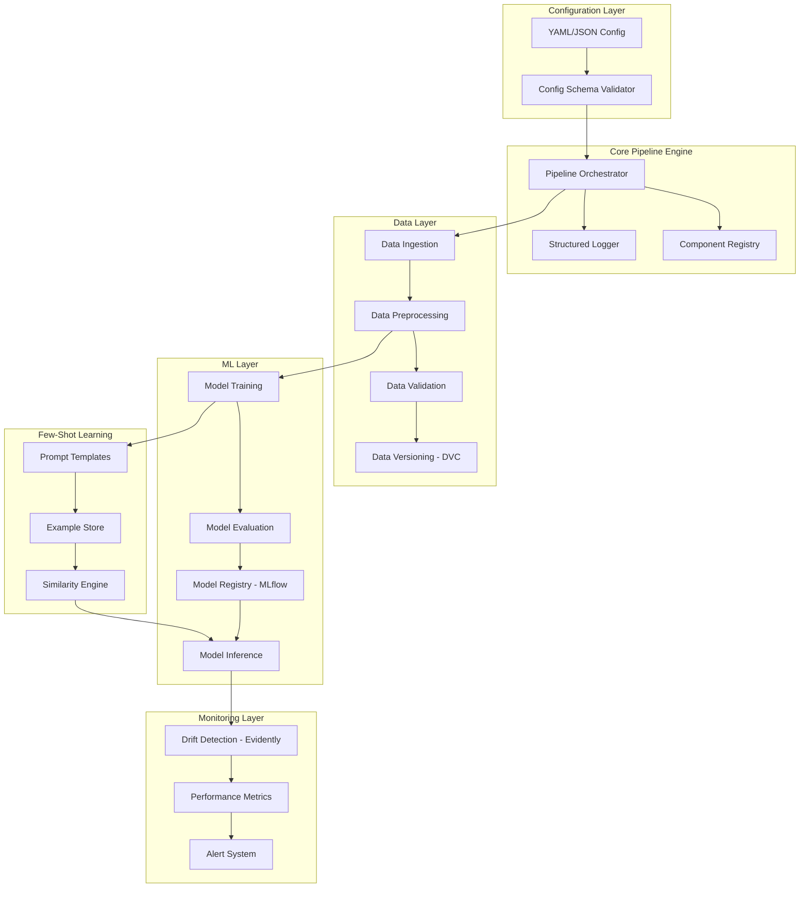

# ML Pipeline Design Document

## Overview

The ML Pipeline system is designed as a modular, extensible framework that orchestrates the complete machine learning workflow from data ingestion to model deployment and monitoring. The architecture follows a plugin-based approach using open source tools, enabling users to configure and execute ML experiments through declarative YAML configurations.

The system leverages established open source tools including:
- **Data Processing**: Pandas, Polars, Apache Arrow
- **ML Frameworks**: Scikit-learn, XGBoost, PyTorch, Hugging Face Transformers
- **Experiment Tracking**: MLflow
- **Data Versioning**: DVC (Data Version Control)
- **Monitoring**: Evidently AI for drift detection
- **Orchestration**: Apache Airflow or Prefect for workflow management

## Architecture



## Components and Interfaces

### 1. Configuration Management

**ConfigManager**
- Validates YAML/JSON configuration files against predefined schemas
- Supports environment variable substitution and default values
- Provides configuration inheritance and overrides

```python
class ConfigManager:
    def load_config(self, config_path: str) -> PipelineConfig
    def validate_schema(self, config: dict) -> ValidationResult
    def resolve_variables(self, config: dict) -> dict
```

### 2. Pipeline Orchestrator

**PipelineOrchestrator**
- Coordinates execution of pipeline stages
- Manages component lifecycle and dependencies
- Handles error recovery and partial execution resumption

```python
class PipelineOrchestrator:
    def execute_pipeline(self, config: PipelineConfig) -> ExecutionResult
    def execute_stage(self, stage: PipelineStage) -> StageResult
    def handle_failure(self, error: Exception, context: ExecutionContext) -> RecoveryAction
```

### 3. Data Processing Components

**DataIngestionEngine**
- Supports multiple data sources (CSV, JSON, Parquet, SQL databases)
- Implements streaming ingestion for large datasets
- Provides data source connectors with authentication

**DataPreprocessor**
- Applies transformations using scikit-learn pipelines
- Supports custom transformation functions
- Maintains preprocessing metadata for inference consistency

**DataValidator**
- Validates data schema and quality constraints
- Detects anomalies and missing values
- Generates data quality reports

### 4. Model Training and Evaluation

**ModelTrainer**
- Supports multiple ML frameworks through adapter pattern
- Implements hyperparameter optimization using Optuna
- Manages train/validation/test splits with stratification

**ModelEvaluator**
- Computes standard classification and regression metrics
- Generates visualization artifacts (confusion matrices, ROC curves)
- Performs statistical significance testing for model comparison

### 5. Drift Detection System

**DriftDetector**
- Integrates with Evidently AI for comprehensive drift analysis
- Supports multiple drift detection methods (KL divergence, PSI, Wasserstein)
- Maintains baseline statistics from training data

**AlertManager**
- Configurable alerting thresholds and channels
- Supports email, Slack, and webhook notifications
- Implements alert suppression and escalation policies

### 6. Few-Shot Learning Engine

**PromptManager**
- Manages prompt templates with variable substitution
- Supports different prompt formats (instruction, chat, completion)
- Provides prompt versioning and A/B testing capabilities

**ExampleStore**
- Stores and retrieves few-shot examples with metadata
- Implements similarity-based example selection using embeddings
- Supports example augmentation and synthetic generation

## Data Models

### Core Configuration Schema

```yaml
pipeline:
  name: "experiment_name"
  version: "1.0.0"
  
data:
  sources:
    - type: "csv"
      path: "data/train.csv"
      schema: "schemas/data_schema.json"
  preprocessing:
    - type: "standard_scaler"
      columns: ["feature1", "feature2"]
    - type: "label_encoder"
      columns: ["category"]
      
model:
  type: "xgboost"
  parameters:
    n_estimators: 100
    max_depth: 6
  hyperparameter_tuning:
    method: "optuna"
    n_trials: 50
    
evaluation:
  metrics: ["accuracy", "f1_score", "roc_auc"]
  cross_validation:
    folds: 5
    stratify: true
    
drift_detection:
  enabled: true
  baseline_data: "data/baseline.csv"
  thresholds:
    data_drift: 0.1
    prediction_drift: 0.05
    
few_shot:
  enabled: false
  prompt_template: "templates/classification.txt"
  max_examples: 5
  similarity_threshold: 0.8
```

### Experiment Metadata

```python
@dataclass
class ExperimentMetadata:
    experiment_id: str
    name: str
    timestamp: datetime
    config_hash: str
    git_commit: Optional[str]
    parameters: Dict[str, Any]
    metrics: Dict[str, float]
    artifacts: List[str]
    status: ExperimentStatus
```

### Drift Detection Results

```python
@dataclass
class DriftReport:
    timestamp: datetime
    data_drift_score: float
    prediction_drift_score: float
    feature_drift_scores: Dict[str, float]
    drift_detected: bool
    visualizations: List[str]
    recommendations: List[str]
```

## Error Handling

### Error Categories

1. **Configuration Errors**: Invalid YAML, missing required fields, type mismatches
2. **Data Errors**: Schema violations, missing files, connection failures
3. **Model Errors**: Training failures, convergence issues, memory limitations
4. **System Errors**: Resource exhaustion, permission issues, network failures

### Error Recovery Strategies

- **Graceful Degradation**: Continue with reduced functionality when non-critical components fail
- **Retry Logic**: Exponential backoff for transient failures (network, resource contention)
- **Checkpointing**: Save intermediate results to enable resumption from failure points
- **Fallback Models**: Use simpler models when complex ones fail to train

### Error Reporting

```python
class PipelineError(Exception):
    def __init__(self, message: str, error_code: str, context: Dict[str, Any]):
        self.message = message
        self.error_code = error_code
        self.context = context
        self.timestamp = datetime.now()
```

## Testing Strategy

### Unit Testing
- Test individual components in isolation using pytest
- Mock external dependencies (databases, APIs, file systems)
- Achieve >90% code coverage for core pipeline logic

### Integration Testing
- Test component interactions with real data samples
- Validate end-to-end pipeline execution with known datasets
- Test configuration loading and validation scenarios

### Performance Testing
- Benchmark data processing throughput with various dataset sizes
- Memory usage profiling for large dataset handling
- Model training time optimization validation

### Drift Detection Testing
- Synthetic drift injection for algorithm validation
- Historical data replay for drift detection accuracy
- Alert system integration testing

### Few-Shot Learning Testing
- Prompt template validation with various input formats
- Example selection algorithm accuracy testing
- Integration testing with different language models

### Test Data Management
- Maintain versioned test datasets with known characteristics
- Generate synthetic data for edge case testing
- Implement data privacy protection for test scenarios

## Deployment and Scalability Considerations

### Containerization
- Docker containers for reproducible environments
- Multi-stage builds for optimized image sizes
- Support for GPU-enabled containers for deep learning

### Horizontal Scaling
- Distributed data processing using Dask or Ray
- Model training parallelization across multiple nodes
- Load balancing for inference endpoints

### Resource Management
- Memory-efficient data loading with chunking
- CPU/GPU resource allocation and monitoring
- Automatic scaling based on workload demands

### Monitoring and Observability
- Structured logging with correlation IDs
- Metrics collection using Prometheus
- Distributed tracing for complex pipeline debugging